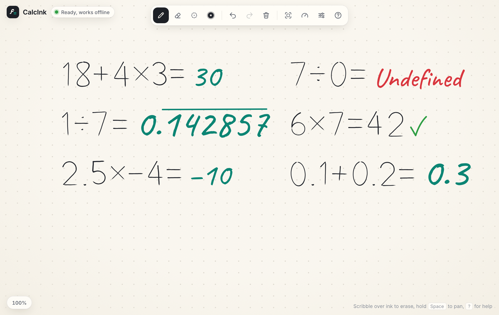
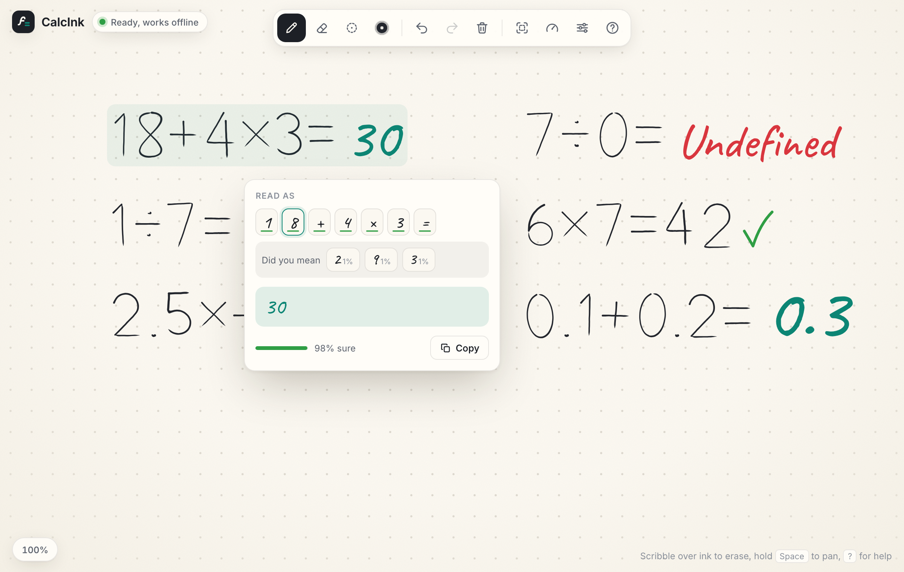
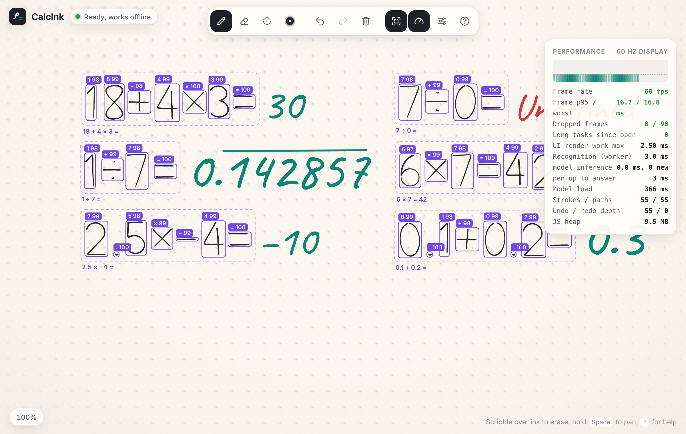
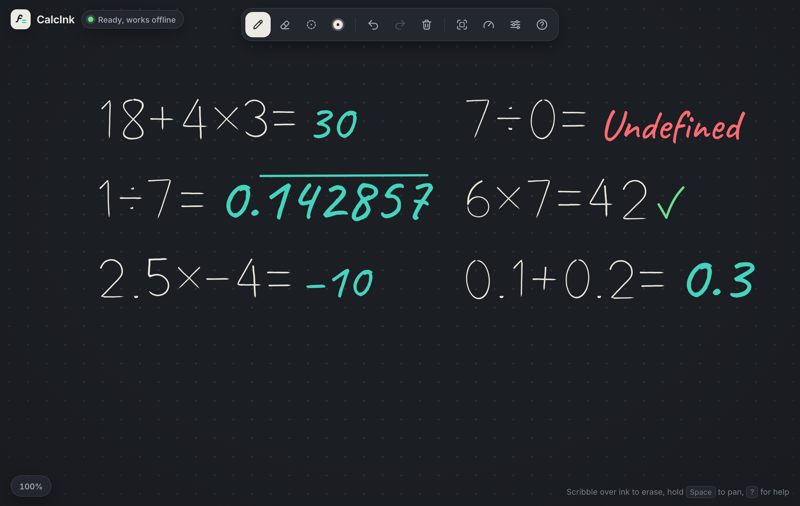
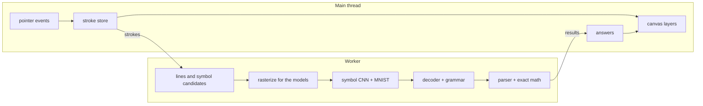

# CalcInk

A handwritten math notebook that runs in the browser. Write a sum like `18 + 4 × 3 =` and the answer gets written next to the equals sign. Edit the sum and the answer updates. Everything runs on your device, including the handwriting recognition, and it works offline once loaded.

Live demo: https://thenirbanghosh.github.io/CalcInk/

Built for the Inter IIT Bootcamp (IIT Guwahati) Phase 1 software problem statement.



| Tap an answer to see what was read | Recognition view and performance stats | Dark theme |
|---|---|---|
|  |  |  |

## Features

- Pen, finger and mouse input with stylus pressure. Undo/redo, stroke eraser, pixel eraser, clear, pen width and color.
- Reads digits 0-9, `+ - × ÷`, the decimal point and `=`.
- Correct order of operations, multi-digit numbers, decimals and negative numbers (`5 × -2.5 =`).
- Exact arithmetic using fractions, so `0.1 + 0.2 = 0.3`. Repeating decimals are shown with a bar (`1 ÷ 7`), division by zero shows Undefined, and broken input shows a `?` instead of crashing. No `eval`.
- If you write your own answer after `=`, it gets checked (tick or cross with the right answer).
- Tap an answer to see what was recognized, how confident it was for each symbol, and fix a symbol in one tap.
- Scribble over ink to erase it.
- Press `X` to see what the recognizer sees, `H` for live performance stats (fps, frame times, recognition time).
- Paper and dark themes, dot/line/grid paper, sounds and haptics (can be turned off), autosave, works as an installable PWA.

## Running it

Needs Node.js 20 or newer.

```bash
npm install
npm run dev
```

Then open http://localhost:5173.

Other commands:

```bash
npm run typecheck
npm test             # unit + integration tests (Vitest), 116 tests
npm run test:e2e     # browser tests (Playwright), 13 tests
npm run build        # production build in dist/
npm run preview      # serve dist/ on http://localhost:4173
```

The first time you run the browser tests you need `npx playwright install chromium`.

## How it works

Short version (the full write-up is in [docs/ARCHITECTURE.md](docs/ARCHITECTURE.md)):

1. Pen input is stored as strokes (lists of points in page coordinates), not pixels.
2. When you pause for 280 ms after lifting the pen, the strokes are sent to a Web Worker. The main thread only handles drawing, so the pen never lags.
3. In the worker, strokes are grouped into lines, then into candidate symbols using simple geometry (strokes that cross are one symbol, two stacked bars are `=`, a dot above a dash is `÷`, and so on).
4. Each candidate is redrawn from its points into the same image format the models were trained on (64x64 for the symbol model, 28x28 for MNIST).
5. Two pre-trained CNNs classify each candidate. The symbol model decides digit vs operator, and both models vote on which digit.
6. A Viterbi decoder picks the most likely reading of the whole line, combining the model scores, the geometry and a small grammar for arithmetic.
7. The line is parsed with a recursive descent parser and evaluated with exact fractions.
8. The answer is drawn next to the `=` on the line's baseline, sized to match your handwriting.



## Models

No model was trained for this project. Both are existing open-source models, converted to ONNX and run with [ONNX Runtime Web](https://onnxruntime.ai) (WebAssembly, inside a Web Worker).

| | Symbol model | Digit model |
|---|---|---|
| Classes | 0-9, +, -, ×, ÷, = | 0-9 |
| Source | [altynbk/handwritten-math-recognition](https://github.com/altynbk/handwritten-math-recognition), `models/cnn_aug.keras` at commit `3d91c0c` | [ONNX Model Zoo, MNIST-12](https://github.com/onnx/models/tree/main/validated/vision/classification/mnist) |
| Author / license | Altynbek Kabiyev, MIT | Microsoft (CNTK tutorial) / ONNX Model Zoo, MIT |
| Architecture | 4 conv blocks (3x3 conv, ReLU, batch norm, max pool) with 32/64/128/256 filters, global average pooling, dropout, dense softmax. 393k parameters | 5x5 conv (8) + pool, 5x5 conv (16) + pool, dense. 6k parameters |
| Trained on | 8,036 handwritten symbol images (author's dataset) | MNIST, 60,000 digits |
| Input | 64x64 grayscale, light ink on dark, cropped with a 15% margin | 28x28, digit in a 20x20 box, centered by center of mass |
| File | `public/models/symbols-cnn.onnx`, 1.58 MB | `public/models/digits-mnist.onnx`, 26 KB |
| Changes | Converted from Keras with tf2onnx. Output matches the Keras model (max diff 1.1e-6) and still scores the published 99.44% on the author's test set | Reshape changed so it accepts batches, output checked against the original |

`scripts/model/build_models.py` rebuilds both files from the original sources and runs those checks. Why these two models and what else we tried (including a 118 MB formula OCR model) is in [docs/MODEL.md](docs/MODEL.md).

## Results

Measured with the same code the browser runs, on Google's [MathWriting](https://github.com/google-research/google-research/tree/master/mathwriting) dataset (real handwriting neither model was trained on), using a held-out half we never tuned anything on:

| Test set | Symbols correct | Whole expression correct | Right answer |
|---|---|---|---|
| Single symbols, all 16 types (219) | 94.1% | | |
| Real handwritten expressions (218) | 88.5% | 70.6% | 92.2% |
| Long expressions built from real symbols (1000) | 93.4% | 52.9% | 55.1% |

Performance (Playwright test writing 6 sums while recognition runs): 60 fps, worst frame 16.8 ms, no long tasks. The answer shows up about 0.4 s after you lift the pen. Memory stays flat over repeated write/undo/clear cycles.

Details, per-symbol numbers and how to reproduce: [docs/EVALUATION.md](docs/EVALUATION.md).

## Project layout

```
src/
  math/          fractions, parser, evaluation, number formatting
  core/          strokes, undo/redo, erasers, scratch-out, zoom/pan
  recognition/   grouping, rasterizing, decoder, grammar, worker
  render/        canvases, ink, answers
  input/         pointer/touch/keyboard handling
  ui/            toolbar popovers, inspector, performance panel
  app/           wiring
tests/           Vitest tests (the recognition tests use the real models)
e2e/             Playwright tests
scripts/         model build script, MathWriting evaluation
docs/            architecture, model choice, evaluation
```

## Deployment

Every push to `main` runs the tests in GitHub Actions and deploys `dist/` to GitHub Pages. It is a static site, so any static host works. Set `BASE_PATH=/your/sub/path/` when building for a sub-path.

## License

MIT. See [THIRD_PARTY_NOTICES.md](THIRD_PARTY_NOTICES.md) for the models, fonts and libraries used.
