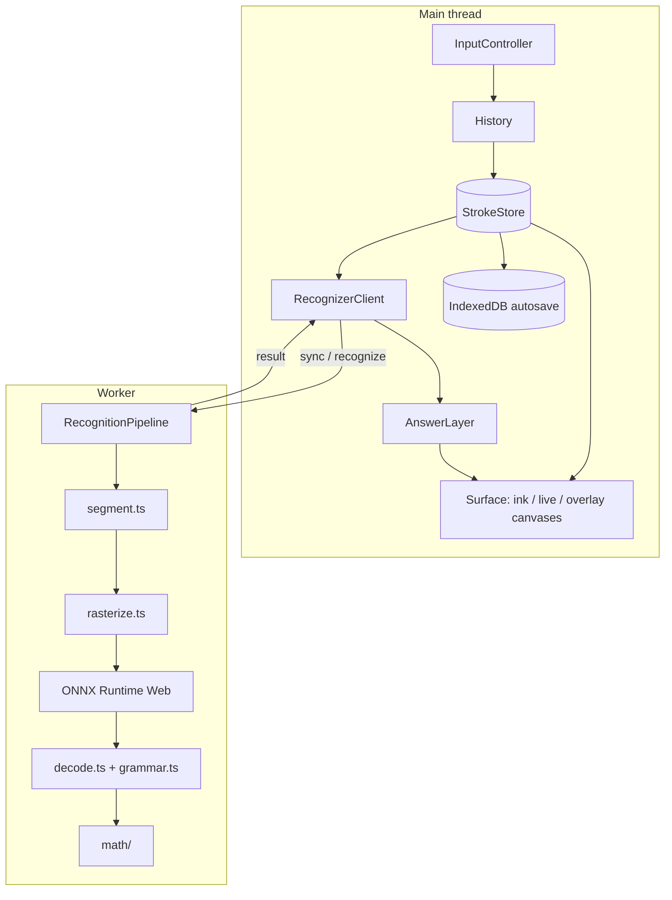

# Architecture

This explains how CalcInk goes from pen strokes to an answer on the page, and why we built it this way. See also [MODEL.md](MODEL.md) for the model choice and [EVALUATION.md](EVALUATION.md) for accuracy and performance numbers.

## Goals from the problem statement

| Requirement | What we did |
|---|---|
| No cloud APIs | Models are bundled as ONNX files and run with ONNX Runtime Web. The WASM runtime is served from our own origin, no CDN, no external fonts. There's a test that checks no request leaves the origin. |
| Works offline | A service worker precaches everything (app, fonts, WASM, both models). A test reloads the app with the network off and checks it still recognizes. |
| 60 FPS while recognizing | The main thread only does input and drawing. Grouping, rasterizing, inference, decoding and evaluation all run in a Web Worker. |
| Re-evaluate on edits | Strokes are immutable and every edit is "strokes removed + strokes added". Recognition reruns on every change, and model results are cached per stroke group so only new strokes hit the models. |
| No eval, no crashes | Our own recursive descent parser over exact fractions. Every input gives a verdict (value, check, undefined, error, incomplete) and nothing throws. |
| Pre-trained model only | Two existing MIT-licensed models, converted (not retrained) by a script. |

## Overview



Data only goes one way. Pointer input goes through the history into the stroke store, and the store change goes to the canvas, the recognizer and autosave. Results from the worker are only drawn, they never change the document.

| Folder | What's in it | Touches the DOM? |
|---|---|---|
| `src/math` | fractions, tokens, parser, evaluation, formatting | no |
| `src/core` | geometry, viewport, stroke store, history, erasers, scratch-out | no |
| `src/recognition` | segmentation, rasterizer, decoder, grammar, pipeline, worker and client | worker only |
| `src/render` | canvases, ink, answers, theme | yes |
| `src/input` | pointer events to edits | yes |
| `src/ui`, `src/app` | toolbar, inspector, performance panel, wiring | yes |

Because `math`, `core` and most of `recognition` don't touch the DOM, the same code runs in the browser worker, in the Vitest tests and in the Node evaluation script.

## Strokes and coordinates

A stroke has an id, a `seq` (writing order), its points as a `Float32Array` of `[x, y, pressure, ...]` in world coordinates, a width, a color and a cached bounding box. Strokes are never modified. The pixel eraser deletes a stroke and adds the pieces that are left, and those pieces keep the parent's `seq` so the writing order doesn't change.

There are three coordinate spaces, and all conversions are in `core/viewport.ts`:

```
screen = world * zoom + pan     (CSS pixels, what pointer events give)
device = screen * devicePixelRatio
```

Ink is stored in world coordinates, so zooming and panning never change it. Each canvas gets a backing store of CSS size times DPR so lines are sharp on Retina screens. We use `devicePixelContentBoxSize` when the browser reports it, but only if it roughly matches CSS size times DPR (under DPR emulation it reported CSS pixels and the canvas ended up blurry).

Every edit is `{ removed, added }`. Undo just applies the opposite change, for all tools. The history is capped at 300 entries.

## Rendering

`render/surface.ts` uses three stacked canvases:

| Layer | Contents | Redrawn when |
|---|---|---|
| ink | finished strokes | new stroke: only that stroke is painted. Erase/undo/zoom/resize/theme: full redraw, culled to the viewport |
| live | the stroke being drawn plus predicted points | every frame while drawing |
| overlay | answers, write-in animation, X-ray, eraser cursor | when results or animations change |

One `requestAnimationFrame` loop draws only the dirty layers and stops when nothing is changing.

Ink outlines come from perfect-freehand (pressure or speed based width, tapered ends). Each finished stroke's `Path2D` is computed once and cached, and the cache entry is deleted with the stroke. The live layer uses a `desynchronized` context where supported, uses every coalesced pointer sample, and draws `getPredictedEvents()` points to hide some latency.

Things we changed after profiling with Chrome traces:

- Creating the `AudioContext` in the first pointerdown blocked for about 199 ms. Now it's created when the browser is idle and only resumed on pointerup.
- The toolbar had `backdrop-filter: blur()`, which caused 55 ms frames whenever ink changed under it. Removed.
- The first path fill and text draw on a canvas is slow (allocation, shaders), so we draw a small invisible sample on each canvas while idle.
- The hidden "Try an example" button was still catching clicks in the middle of the page. Fixed with `visibility: hidden` and `pointer-events: none`.

## Input

`input/controller.ts` turns pointer events into edits:

- Pen, finger and mouse all draw. Points closer than half a pixel are dropped. Pressure is only used for real styluses.
- Once a stylus has been used, single-finger touches pan instead of drawing (palm rejection).
- Two fingers pinch/pan. Wheel pans, Ctrl/Cmd+wheel zooms around the cursor. Space+drag or middle mouse pans.
- The eraser end of a stylus erases no matter which tool is selected.
- A tap on an answer opens the inspector, a tap anywhere else is a decimal point. A tap means the pointer barely moved (path length under 5 px). Checking only the start and end position wasn't enough because a fast "0" ends where it starts.
- Scratch-out (`core/gestures.ts`): a stroke with at least 4 sharp turns and a path much longer than its size is a scribble. It erases strokes whose bounding box it covers by at least 45%. A scribble on empty paper stays as ink.

## Recognition

`recognition/pipeline.ts`, running inside `recognition/worker.ts`:

```
strokes -> findLines -> candidates -> rasterize (uncached only) -> both models (batched)
        -> label probabilities + priors -> decodeLine (Viterbi) -> evaluateLine -> results
```

### Lines (`segment.ts`)

1. Anchors are upright strokes (height at least half the width) that are at least 40% as tall as the tallest stroke next to them. These are digits and the vertical parts of `+` and `×`.
2. Anchors of similar height (ratio under 2.6) that overlap vertically by more than 40% and are within 2.2 heights horizontally are joined into a line.
3. The other strokes (`-`, `=` bars, `÷` dots, decimal points) are attached to the line whose band they fall in, measured in that line's own size.
4. Anything left over makes its own line.

An earlier version measured "tall" against the whole page, so small writing right under big writing got merged into the big line. Judging against neighbors fixed it.

### Candidate symbols

Strokes in a line are sorted left to right and grouped into runs of 1 to 4 strokes that could be one symbol. For each pair of nearby strokes `sameSymbolProb` gives a geometric score:

| Situation | Score |
|---|---|
| strokes cross (`+`, `×`, 7 with a bar) | 0.99 |
| strokes touch and overlap horizontally (4, 5) | 0.92 |
| two flat bars stacked (`=`) | 0.85 |
| two short straight parallel bars, tilted up to about 55 degrees (fast `=`) | 0.80 |
| dot above or below a dash (`÷`) | 0.80 |
| dash near the top of the line written right after a tall stroke (hat of a 5) | 0.60 |
| more or less horizontal overlap | 0.45 / 0.25 |
| other strokes written in between | multiplied by 0.7 or 0.35 |

### Strokes to model input (`rasterize.ts`)

We redraw each candidate from its points instead of cropping the canvas, and we copy the preprocessing each model was trained with:

- Symbol CNN (64x64x1): bounding box of the ink, padded to a square with a 15% margin per side, lines 4.6 px wide (the median stroke width of the training images), light on dark.
- MNIST (1x28x28): longest side fits a 20x20 box, then shifted so the center of mass is at (14, 14), lines 1.6 px wide.

Because it works from points, zoom, DPI, pen width and color don't affect recognition. There are tests for centering, margins and invariance to translation and scale.

### Combining the models

For each candidate:

1. The symbol CNN gives 15 probabilities (0-9, `+ ÷ = × -`).
2. MNIST reads the same candidate 3 times with the ink sheared by -0.2, 0 and +0.2, and the log probabilities are averaged.
3. The symbol CNN's total digit probability is kept (MNIST has never seen an operator). Within the digits the two are mixed as `p_cnn(d|digit)^0.6 * p_mnist(d)^0.4`.
4. Probabilities are softened with temperature 2. The CNN tends to say 1.00 even when it's wrong on unfamiliar handwriting, which leaves no room for the other evidence.
5. The decimal point comes from size, not the model. After the crop-and-scale step a dot looks the same as a filled 0, so a candidate smaller than 30% of the line's digit height gets 0.97 for `.`.
6. Layout prior: digits should be close to full height, operators sit near the middle of the line. A half-height symbol is unlikely to be a 1 (usually it's a `+` with a low bar).

### Decoding (`decode.ts`, `grammar.ts`)

Instead of picking a grouping first and classifying after, the decoder searches groupings and labels together and returns the best reading of the whole line:

```
score = sum over symbols of [ log P(label | image) + log P(strokes belong together) ]
      + sum over cuts of log P(neighbors are separate)
      + grammar cost
```

Groups are contiguous in left-to-right order, so this is a Viterbi pass over (strokes consumed, grammar state). The grammar is a small state machine for `expr [= [expr]]` where `expr = [±] number (op [±] number)*`. It's soft: an invalid step costs log(1e-4), so messy input still decodes to something, but a valid reading wins when the ink is ambiguous.

One special case: `=` right after an operator only costs log(0.05). That's what a line looks like right after you erase a digit. Without it the decoder turned `14 + =` into `14 - 1 = 13` and showed a wrong answer while editing.

### Cache

Model results are cached by the sorted stroke ids of the group (LRU, 4096 entries). Since strokes never change, a cached result never goes stale. Erasing a 3 and writing a 9 reruns the models on 3 groups or fewer. Corrections from the inspector are stored as overrides on the same keys.

### Worker messages

```ts
// main -> worker
{ type: 'init', baseUrl, wasmUrl }
{ type: 'sync', added, removed }        // on every edit
{ type: 'recognize', requestId, version } // 280 ms after pen up
{ type: 'override', key, label }        // correction from the inspector
// worker -> main
{ type: 'ready', loadMs } | { type: 'error', message }
{ type: 'result', requestId, version, lines, stats }
```

Messages that arrive while the models are loading are queued, so nothing drawn during startup is lost. Recognition doesn't run while the pen is down, and results for an older document version are dropped. ONNX Runtime runs single threaded WASM with SIMD, so no COOP/COEP headers are needed and it works on GitHub Pages.

Typical timing in headless Chrome: models load in about 0.3-0.5 s, a new 11-stroke line takes about 100 ms in the worker (85 ms of that is inference), and the answer appears about 0.4 s after the pen lifts.

## Math (`src/math`)

- `rational.ts`: exact fractions with BigInt, so `0.1 + 0.2` is exactly `0.3`.
- `parser.ts`: recursive descent. `expr := term (± term)*`, `term := unary (×÷ unary)*`, `unary := ± unary | number`. That gives BODMAS and left-to-right order, and unary minus handles negatives like `5 × -2`.
- `evaluate.ts`: returns `incomplete` (no `=`), `value`, `check` (the user wrote an answer after `=`), `undefined` (division by zero) or `error` (with the position of the bad symbol).
- `format.ts`: long division with a map of remainders to find repeating parts (`1/7 = 0.(142857)`), rounding with an ellipsis for long periods, scientific notation for huge or tiny values, and an exact fraction for fraction mode.

## Answers

The answer starts 0.35 line-heights to the right of the `=`, on the median baseline of the line's digits, in the Caveat font scaled so its digits are as tall as the user's (the font's digit height is measured at startup). New answers are revealed left to right with a small dot moving along like a pen tip, removed ones fade out. If the user wrote an answer we draw a tick or a cross with the right value. If any symbol had low confidence the answer is drawn a bit faded with a small `?`. Long answers shrink (down to 45%) if they would run into other ink on the same row.

## Offline

`vite-plugin-pwa` generates a service worker that precaches 24 files (about 15.9 MB, mostly the 14.2 MB ORT WASM file, about 3.7 MB gzipped). Only Latin font subsets are cached. The WASM file is imported through Vite and passed to `env.wasm.wasmPaths` so ORT never tries a CDN. The status pill only says "works offline" once a service worker is active. The notebook is saved in IndexedDB.

## Memory

The only document state is the strokes. The path cache, the model cache (4096) and the history (300) are all bounded or tied to strokes. ORT tensors are disposed after each run. The memory test runs 12 rounds of write, recognize, undo, redo, clear, forces GC through CDP and checks the heap didn't grow (9.54 MB before and after). That test found a leak where the fade-out animation re-added erased strokes to the path cache.

## Tests

| What | Tool | Covers |
|---|---|---|
| math | Vitest + fast-check | precedence, decimals, negatives, division by zero, bad input, formatting, 2000 random expressions vs direct evaluation, 5000 random symbol strings |
| core | Vitest + fast-check | coordinate round trips, backing store sizes, random undo/redo sequences, erasers, scratch-out vs real digits |
| recognition | Vitest + onnxruntime-node (real models) | rasterizer geometry, 8 expressions in 6 generated handwritings, sizes from 18 to 400, close lines, mixed sizes, caching, priors |
| app | Playwright on the production build | write and get the answer, editing, undo/redo, checking, scratch-out, inspector, no external requests, offline reload, 60 fps, memory, Retina |
| accuracy | `npm run eval` | MathWriting, see EVALUATION.md |

The test handwriting comes from `src/demo/handwriting.ts`, which draws each symbol from a few curves with random slant, size and wobble based on a seed. The "Try an example" button uses the same code.

## Limitations

- The ORT WASM file is big for what it runs (14 MB for 1.6 MB of models). A custom minimal ORT build would fix that.
- The symbol model was trained on a small dataset from a few people, so 4 and `+` are its weakest symbols on new handwriting. The second model, the priors and the decoder help a lot, and the inspector covers the rest.
- No parentheses, powers or variables, since neither model knows those symbols.
- Inference is single threaded to keep hosting simple. It's already faster than the 280 ms pause we wait for.

## Future work

A model that knows letters and parentheses (for example one trained on HASYv2) for variables and graphing, column sums, multiple pages, and a WebGPU path for bigger models.
